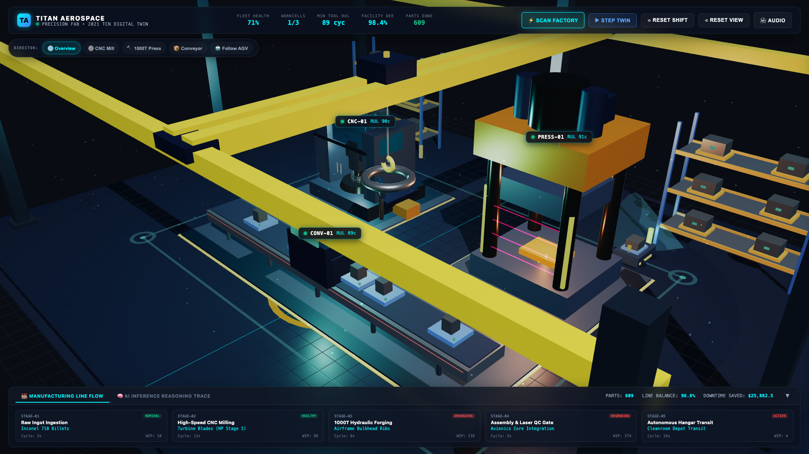
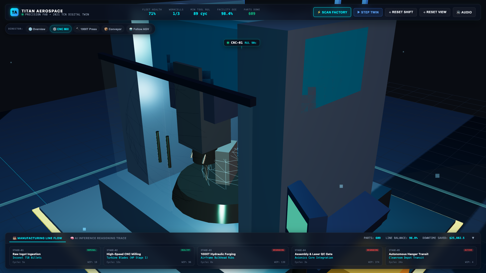
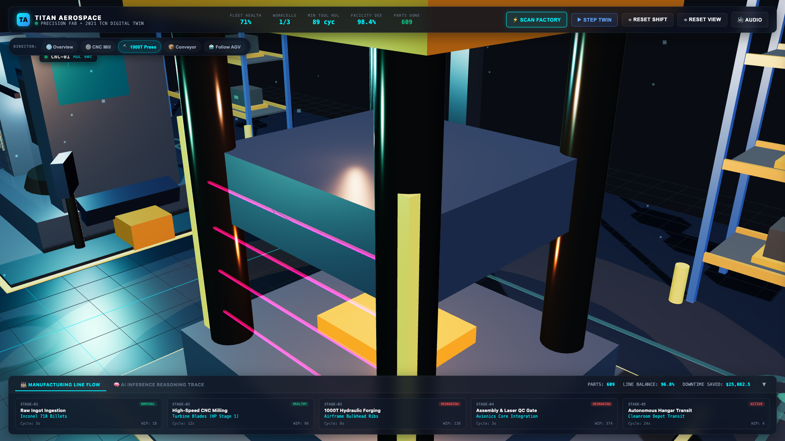
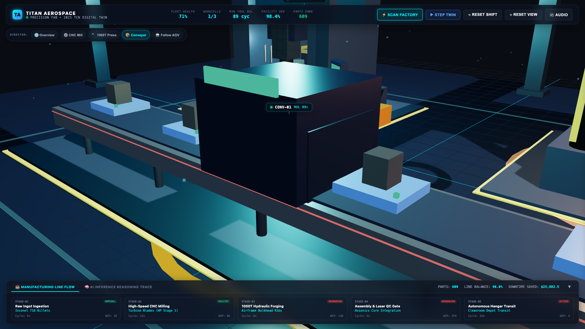
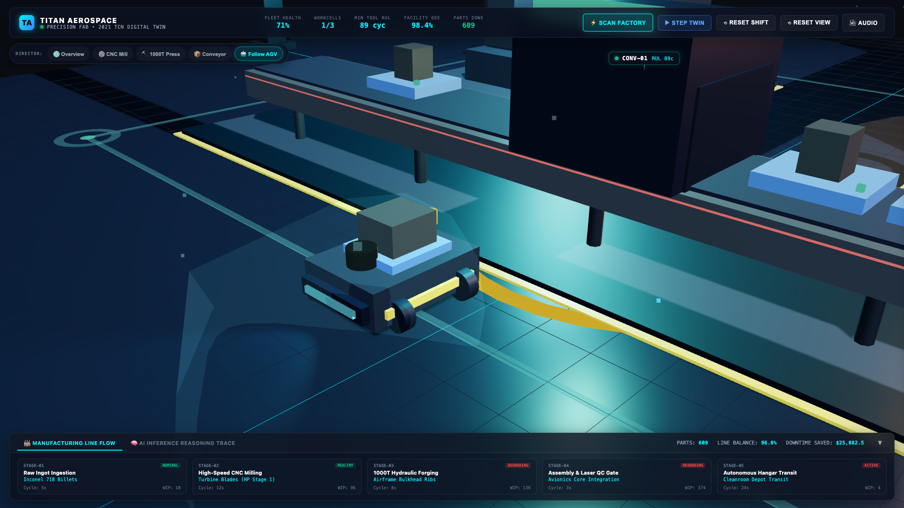
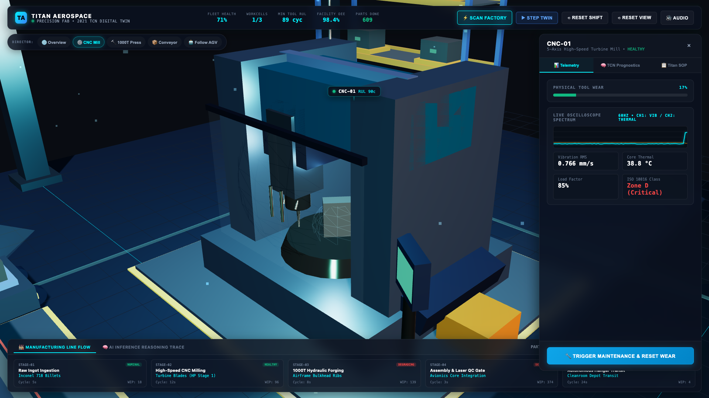
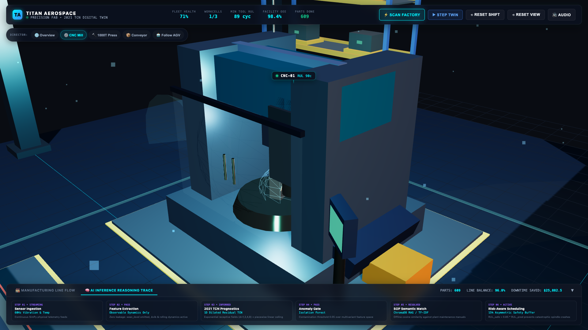

# 🏭 Titan Aerospace — Smart Manufacturing Digital Twin Copilot

> **"What if managing an entire aerospace factory felt like playing an RTS strategy game?"**  
> An autonomous agentic predictive-maintenance operations center for precision aerospace manufacturing —  
> **100% Pure Local Machine Learning &bull; 100% Offline &bull; ZERO API Keys &bull; Zero Node/NPM Build Overhead**.

[](file:///Users/ykanagaraj/Downloads/Personal%20Projects/digital-twin-copilot/tests)
[](file:///Users/ykanagaraj/Downloads/Personal%20Projects/digital-twin-copilot/ml_pipeline/tcn_model.py)
[](file:///Users/ykanagaraj/Downloads/Personal%20Projects/digital-twin-copilot/agents/orchestrator.py)
[](file:///Users/ykanagaraj/Downloads/Personal%20Projects/digital-twin-copilot/web)

---

## 📸 Visual Showcase: Darkvex RTS Operations Center

Below are live screenshots of the hardware-accelerated 3D operations center captured directly from the running WebGL simulation across multiple camera angles:

### 1. 🌐 Global Factory Overview (Isometric Command Center)
*Full plant overview featuring multi-tier High-Bay Storage Racks (ASRS), dynamically traversing overhead gantry crane, three raised machine foundation bays (`BAY-01`, `BAY-02`, `BAY-03`), floating holographic telemetry badges, and the live manufacturing line flow ribbon.*


---

### 2. ⚙️ `CNC-01`: DMG MORI 5-Axis Turbine Machining Center
*Close-up inspection view of the 5-axis milling center cutting Inconel 718 turbine airfoils. Features an aerodynamic sheet metal enclosure, dual sliding safety glass doors, radial 6-tool carousel magazine, swarf chip auger chute & disposal bin, translating tool carriage, coolant mist aura, and interior cyan worklight.*


---

### 3. 🔨 `PRESS-01`: 1000-Ton Hydraulic Forging Press
*Heavy industrial forging bay fabricating titanium airframe bulkheads. Features massive chromed tie-rod columns with hex nut caps, overhead nitrogen accumulators, fluid reservoir tank, manifold with braided stainless piping, glowing ruby infrared photoelectric safety light curtains, and a glowing $1200^\circ\text{C}$ hot billet with floor impact shockwave effects.*


---

### 4. 📦 `CONV-01`: Dual-Rail Conveyor & Enclosed Laser QC Tunnel
*Automated avionics and blade integration conveyor with emergency red E-stop pull cords. Features an enclosed Laser QC Inspection Tunnel arch with an active vertical cyan laser triangulation scanning plane, overhead digital tolerance HUD (`TOLERANCE ±0.002mm • LASER TRIANGULATION ACTIVE`), and moving aerospace pallet fixtures.*


---

### 5. 🤖 `AGV-01`: Autonomous Patrol AMR (Dynamic Chase Cam)
*Live follow-cam tracking the armored AMR rover navigating the rectangular factory transit corridor. Features industrial mecanum wheels, rotating 3D LiDAR puck with forward-projecting cyan scan cone, forward driving headlights casting dynamic illumination onto the floor, flashing amber safety beacon, and secured payload pallet.*


---

### 6. 📊 Holographic SCADA Inspection Drawer
*Slide-out SCADA diagnostic drawer opened by clicking any machine or floating badge. Features real-time physical wear progression, dual-channel 60 FPS oscilloscope spectrum (Ch1: Vibration RMS, Ch2: Core Thermal gradient), 2021 TCN Prognostics hero metric with 15% asymmetric safety margin breakdown, ISO 10816 vibration classification, Titan Aerospace SOP protocol, and one-click closed-loop maintenance execution.*


---

### 7. 🧠 6-Step AI Inference Reasoning Trace
*Bottom process pipeline switched to AI reasoning chain mode. Displays real-time status across all 6 reasoning stages: 60Hz Telemetry Stream &rarr; Zero-Leakage Feature Extraction &rarr; 1D Dilated Residual TCN &rarr; Isolation Forest Anomaly Gate &rarr; ChromaDB SOP Semantic Matcher &rarr; 15% Asymmetric Safety Scheduler.*


---

## 🎯 Core Purpose & What We Are Doing Here

### The Problem
Traditional SCADA software and manufacturing dashboards (Siemens WinCC, Wonderware, Ignition) are built like 1990s desktop spreadsheets: static 2D tables, disconnected time-series charts, and alarm lists that cause cognitive overload. When a critical spindle bearing begins to degrade, operators are inundated with raw threshold alarms without predictive remaining life estimates, root-cause standard operating procedures, or automated remediation.

### The Solution: Digital Twin Copilot
This project demonstrates how next-generation smart factories should operate by fusing three key disciplines into a single cohesive platform:

1. **Physics-Driven Discrete-Event Digital Twin**:
   A high-fidelity physical factory simulation running via **SimPy**. Models a mission-critical aerospace production line (**Titan Aerospace Precision Fab**) manufacturing aircraft engine turbine blades (Inconel 718), airframe bulkhead ribs (Titanium alloy), and avionics core assemblies. Simulates continuous mechanical wear accumulation, thermal dissipation, 60Hz high-frequency vibration harmonic drift, work-in-progress (WIP) queues, and line balancing.

2. **100% Pure Local Machine Learning (Zero API Keys & Zero Cost)**:
   - **2021 PHM Competition Winning Prognostics**: Implements the architecture of Team "IJoinedTooLate" (1st Place, 2021 PHM Data Challenge):
     - **Dilated 1D Causal Temporal Convolutional Networks (TCN)** with exponentially growing receptive fields ($d = 1, 2, 4, 8$) capturing long-term wear trends without recurrent vanishing-gradient bottlenecks.
     - **Variable-Length Sequence Processing**: Evaluates degradation over rolling time windows rather than instantaneous point snapshots.
     - **Piecewise Linear RUL Target**: Caps early healthy cycles at a maximum ceiling ($RUL_{\text{max}}$) to stabilize training dynamics.
     - **Zero Feature Leakage**: Unlike naive tutorials that cheat by passing `wear_level` into model features, our pipeline uses strictly observable sensors (`vibration_rms`, `temperature_c`, $\Delta\text{vibration}$, $\Delta\text{temperature}$, rolling dynamics).
     - **15% Asymmetric Industrial Safety Buffer**: Overestimating tool life leads to catastrophic spindle tool collisions. The scheduler applies $\text{RUL}_{\text{safe}} = 0.85 \times \text{RUL}_{\text{pred}}$ to guarantee zero in-cut failures.
   - **Isolation Forest Anomaly Gate**: Multivariant unsupervised anomaly detector screening sensor streams for early micro-chatter and bearing pitting.
   - **Offline Local SOP Matching**: Local TF-IDF cosine similarity search over plant maintenance Standard Operating Procedures (SOPs) stored in **ChromaDB**. Eliminates all external LLM API dependencies (no OpenAI, no Groq, no Anthropic, zero latency, zero tokens, zero monthly bills).

3. **Autonomous Closed-Loop LangGraph Copilot**:
   A deterministic multi-agent state graph orchestrating the maintenance lifecycle:
   $$\text{Physical Twin} \xrightarrow{\text{Telemetry}} \text{Monitor Agent} \xrightarrow{\text{Anomaly}} \text{Diagnosis Agent} \xrightarrow{\text{SOP Match}} \text{Scheduler Agent} \xrightarrow{\text{Dispatch}} \text{Closed-Loop Twin Interruption}$$
   The copilot autonomously pauses degraded machines, schedules work orders, dispatches robotic maintenance, and resets tool wear back to nominal condition in the live physical simulation.

4. **AAA RTS Strategy Game 3D Operations Center**:
   Built with **Three.js** and WebGL, inspired by the tactical strategy-game aesthetic from [darkvex.ai](https://www.instagram.com/reel/DeG2mQszTrc/). Features:
   - Real-time hardware-accelerated 3D factory floor with reflective epoxy slab, perimeter I-beams, and high-bay warehouse pallet storage racks.
   - Overhead yellow industrial gantry crane dynamically traversing across the facility bay carrying turbofan casing components.
   - High-detail procedural machinery models (`CNC-01` 5-axis mill with tool carousel & chip auger, `PRESS-01` 1000T press with photoelectric ruby safety light curtains, `CONV-01` assembly conveyor with Laser QC arch, and `AGV-01` AMR rover with rotating 3D LiDAR cone and roving floor headlights).
   - Floating 3D holographic badges projected from world space to screen space.
   - Sleek Camera Director Bar with 5 one-click presets (`Overview`, `CNC Mill`, `1000T Press`, `Conveyor`, `Follow AGV`).
   - Collapsible bottom Process Pipeline Ribbon displaying physical part flow and the 6-step AI reasoning trace.
   - Procedural Web Audio API synthesizer generating tactical SFX without external audio files.

---

## 🏛️ System Architecture

```
+-------------------------------------------------------------------------------------------------------+
|                                  PHYSICAL DIGITAL TWIN (SimPy)                                        |
|                                                                                                       |
|   Inconel Ingestion ──► CNC-01 (Milling) ──► PRESS-01 (1000T Forge) ──► CONV-01 (QC) ──► AGV-01 Transit |
|                         Vibration RMS • Core Temperature °C • WIP Throughput • Line Balance           |
+---------------------------------------------------+---------------------------------------------------+
                                                    |
                                                    v
+-------------------------------------------------------------------------------------------------------+
|                              LOCAL ML PROGNOSTICS PIPELINE (100% Offline)                             |
|                                                                                                       |
|  • Feature Engineering: Zero leakage (observable sensors & rolling dynamics only)                      |
|  • Anomaly Detection: Isolation Forest contamination filter                                           |
|  • RUL Prognostics: 2021 PHM Winner Dilated 1D TCN (d = 1, 2, 4, 8) + Piecewise Linear Target         |
|  • Fallback Engine: Scikit-Learn HistGradientBoostingRegressor                                        |
+---------------------------------------------------+---------------------------------------------------+
                                                    |
                                                    v
+-------------------------------------------------------------------------------------------------------+
|                               CLOSED-LOOP AGENT GRAPH (LangGraph)                                     |
|                                                                                                       |
|  [Monitor Agent]      ──► Identifies statistical & ML anomaly spikes                                  |
|  [Diagnosis Agent]    ──► Local TF-IDF cosine matching against ChromaDB plant SOPs (ISO 10816)         |
|  [Scheduler Agent]    ──► Applies 15% Asymmetric Safety Buffer (RUL_safe = 0.85 * RUL_pred)           |
|  [Closed-Loop Action] ──► Interrupts physical SimPy twin, triggers maintenance, resets wear           |
+---------------------------------------------------+---------------------------------------------------+
                                                    |
                                                    v
+-------------------------------------------------------------------------------------------------------+
|                        3D STRATEGY OPERATIONS CENTER (FastAPI + Three.js)                             |
|                                                                                                       |
|  • WebGL 60 FPS Viewport  • Camera Director Bar  • 3D Floating Badges  • SCADA Drawer Oscilloscope   |
|  • Manufacturing Pipeline Ribbon  • Laser Radar Sweep  • Web Audio Procedural Synthesizer             |
+-------------------------------------------------------------------------------------------------------+
```

---

## 📁 Repository Structure

```
digital-twin-copilot/
├── digital_twin/
│   ├── models.py              # Physical machine states, configs & maintenance events
│   └── simulator.py            # SimPy discrete-event physical twin engine
├── ml_pipeline/
│   ├── features.py            # Observable sensor feature extraction & piecewise clipping
│   ├── tcn_model.py           # 2021 PHM Winner 1D Dilated Temporal Convolutional Network
│   ├── anomaly_detector.py    # Isolation Forest multivariant detector
│   └── rul_predictor.py       # Sequence-based TCN predictor + GBDT fallback
├── rag/
│   ├── documents/             # ISO 10816 SOP maintenance manuals (CNC, Press, Conveyor)
│   └── knowledge_base.py      # ChromaDB vector store + TF-IDF cosine similarity search
├── agents/
│   ├── state.py               # Shared LangGraph agent state dictionary
│   ├── tools.py               # Closed-loop tools (what-if simulator, repair execution)
│   ├── monitor_agent.py       # Statistical and ML telemetry scanner
│   ├── diagnosis_agent.py     # Local NLP SOP root-cause diagnosis matcher
│   ├── scheduler_agent.py     # 15% asymmetric safety-margin maintenance scheduler
│   └── orchestrator.py        # LangGraph wiring and simulation execution graph
├── api/
│   └── main.py                # FastAPI backend serving endpoints and static 3D webapp
├── web/
│   ├── index.html             # Glassmorphic RTS HUD & WebGL canvas container
│   ├── css/
│   │   └── style.css          # Sci-fi glassmorphic CSS, SCADA drawer & animations
│   ├── js/
│   │   ├── app.js             # Main application orchestrator & live polling loop
│   │   ├── scene.js           # Three.js scene engine, lighting, camera director & dust FX
│   │   ├── models.js          # Procedural 3D machinery (ASRS racks, crane, CNC, Press, AGV)
│   │   ├── hud.js             # Top KPIs, floating badges, oscilloscope & pipeline ribbon
│   │   └── audio.js           # Procedural Web Audio API sound synthesizer
│   └── vendor/
│       ├── three.min.js       # Vendored Three.js core (offline zero-build)
│       └── OrbitControls.js   # Vendored camera orbit controls
├── docs/
│   └── screenshots/           # High-resolution screenshots of the 3D operations center
├── tests/
│   ├── test_digital_twin.py   # Physical simulation tests
│   ├── test_ml_pipeline.py    # TCN & anomaly detector tests
│   ├── test_agents.py         # Multi-agent LangGraph workflow tests
│   └── test_api_web.py        # FastAPI endpoints & pipeline flow tests
├── capture_screenshots.py     # Playwright multi-angle screenshot capture script
├── requirements.txt
└── README.md
```

---

## ⚡ Quickstart

### 1. Prerequisites & Installation

Requires **Python 3.10+**. Zero external API keys, zero node/npm build dependencies:

```bash
# Clone the repository
git clone git@github-personal:vishnu-0011/digital-twin-copilot.git
cd digital-twin-copilot

# Create and activate virtual environment
python3 -m venv venv
source venv/bin/activate

# Install dependencies
pip install -r requirements.txt
```

### 2. Run Automated Verification Tests

```bash
python -m unittest discover -s tests -p "test_*.py"
```
*(All 16 unit and integration tests run in ~30s with 100% pass rate).*

### 3. Launch the 3D Strategy Game Operations Center

```bash
uvicorn api.main:app --port 8000
```

Open your browser to:
👉 **`http://localhost:8000/`**

---

## 🎮 How to Interact with the Operations Center

- **Camera Director Presets**: Click `🌐 Overview`, `⚙️ CNC Mill`, `🔨 1000T Press`, `📦 Conveyor`, or `🤖 Follow AGV` on the floating director bar to smoothly fly the camera across the plant.
- **Inspect Workcells**: Click any machine in the 3D scene or its floating screen-space badge to open the **Holographic SCADA Drawer**. Inspect live 60 FPS vibration waveforms, core thermal gradient, TCN remaining life forecasts, and Titan Aerospace standard operating procedure recommendations.
- **Trigger Closed-Loop Maintenance**: Click **"🔧 Trigger Maintenance & Reset Wear"** inside the SCADA drawer to dispatch maintenance in real time, resetting the physical twin's wear back to nominal.
- **Toggle Process Flow Modes**: Toggle between **"🏭 Manufacturing Line Flow"** (tracking parts transit from Ingot Staging through to AGV cleanroom dispatch) and **"🧠 AI Inference Reasoning Trace"** (revealing the 6-step ML pipeline from raw sensor feeds to risk-buffered scheduling).
- **Sweep Factory Radar**: Click **"⚡ Scan Factory"** to sweep a glowing cyan laser plane across the facility, trigger the LangGraph anomaly detection cycle, and produce tactical synthesizer audio feedback.
- **Step Simulation Cycle**: Click **"▶ Step Twin"** to advance the SimPy physical simulation clock forward.

---

## 📄 License

MIT License. Designed with highest-effort engineering for smart manufacturing digital twin operations.
