# 🏭 Titan Aerospace — Smart Manufacturing Digital Twin Copilot

> **"What if managing an entire aerospace mega-factory felt like playing an RTS strategy game?"**  
> An autonomous agentic predictive-maintenance operations center for precision aerospace manufacturing —  
> **100% Pure Local Machine Learning &bull; 100% Offline &bull; ZERO API Keys &bull; Zero Node/NPM Build Overhead**.

[](file:///Users/ykanagaraj/Downloads/Personal%20Projects/digital-twin-copilot/tests)
[](file:///Users/ykanagaraj/Downloads/Personal%20Projects/digital-twin-copilot/digital_twin/simulator.py)
[](file:///Users/ykanagaraj/Downloads/Personal%20Projects/digital-twin-copilot/ml_pipeline/tcn_model.py)
[](file:///Users/ykanagaraj/Downloads/Personal%20Projects/digital-twin-copilot/agents/orchestrator.py)
[-facc15?style=for-the-badge)](file:///Users/ykanagaraj/Downloads/Personal%20Projects/digital-twin-copilot/web)
[-10b981?style=for-the-badge&logo=markdown)](file:///Users/ykanagaraj/Downloads/Personal%20Projects/digital-twin-copilot/About.md)

> [!IMPORTANT]
> **New to the project or looking for an onboarding primer?**  
> 📖 Check out [**`About.md`**](file:///Users/ykanagaraj/Downloads/Personal%20Projects/digital-twin-copilot/About.md) for a comprehensive, beginner-friendly guide written specifically for teammates with zero prior knowledge of this codebase. It covers:
> - **The 60-Second Plain-English Pitch & Real-World Problem** ($22k/hr downtime & SCADA alarm fatigue)
> - **How Data Is Collected From Machines** (SimPy 60Hz physics & the strict zero-feature-leakage rule)
> - **How the ML Models Identify What Is Wrong** (2021 PHM winner TCN, Isolation Forest, ISO 10816 standards, SOP checklists)
> - **Answers to Most Frequently Asked Business Questions** (ROI, air-gapped security, legacy retrofitting)
> - **Step-by-Step Local Setup & Viva/Presentation Speaking Guide**

---

## 🎥 Live Motion Demonstration (3-Second Cleanroom Tour)

> **Continuous 60 FPS WebGL simulation loop:** Autonomous AMRs patrolling corridors, robotic deburring arm in motion, and live 10-stage WIP line flow.

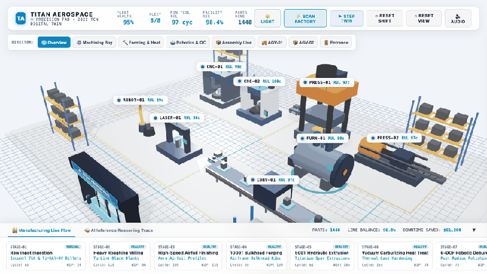

*Native 720p 60 FPS recording available in [`docs/videos/factory_tour.webm`](docs/videos/factory_tour.webm).*

---

## 📸 Visual Showcase: Titan Aerospace Campus & Cleanroom Mega-Factory

Below are live screenshots of the hardware-accelerated 3D operations center captured directly from the running WebGL simulation across multiple camera angles, environmental modes, and operational states:

### 1. 🏢 Titan Aerospace City Campus & Bustling Town Exterior
*Full town campus overview featuring the exterior architectural factory building covered with realistic walls, ribbon windows, rooftop HVAC chillers, solar arrays, and illuminated rooftop company branding. Surrounding the facility is an active town environment: two-lane asphalt roads with continuous animated traffic (cars, delivery vans, cargo trucks), marked employee parking with EV charging pedestals, security guardhouse with barrier arm, covered pedestrian walkway canopy, sidewalks, street trees, streetlamps, and an open, uncluttered vista.*
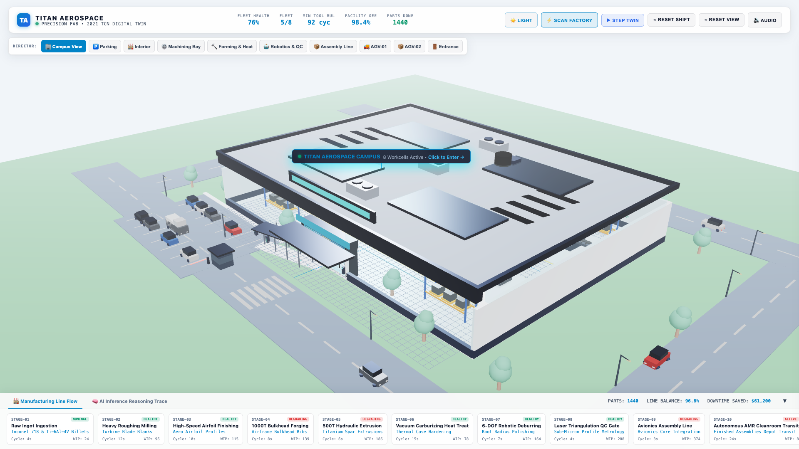

---

### 2. 🌐 Dollhouse Cutaway: Cleanroom Interior (`8 Workcells Active`)
*Clicking the building exterior or selecting `🏭 Interior` smoothly glides the camera inside while the procedural roof slab and upper walls disappear in a dollhouse cutaway. Reveals an expanded 64m × 48m polished white epoxy cleanroom floor, unobstructed open vista, 8 specialized workcells across 4 zoned bays, floating screen-space telemetry badges, and live 10-stage process pipeline.*
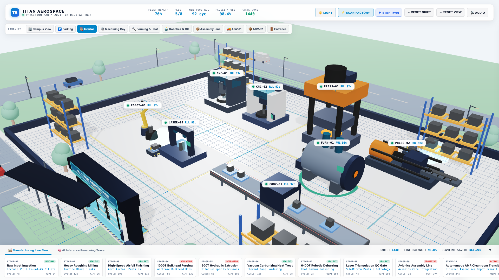

---

### 3. ⚙️ Bay 1: CNC Machining Centers (`CNC-01` & `CNC-02`)
*Machining Bay dedicated to turbine blades and aero airfoils. Left: `CNC-01` 5-Axis Heavy Roughing Mill (DMG MORI style enclosure, sliding glass doors, 6-tool carousel magazine, chip auger chute & bin). Right: `CNC-02` 5-Axis High-Speed Airfoil Finishing Center (granite portal bridge, tilting trunnion table, roof mist extraction filtration unit, Siemens 840D console).*
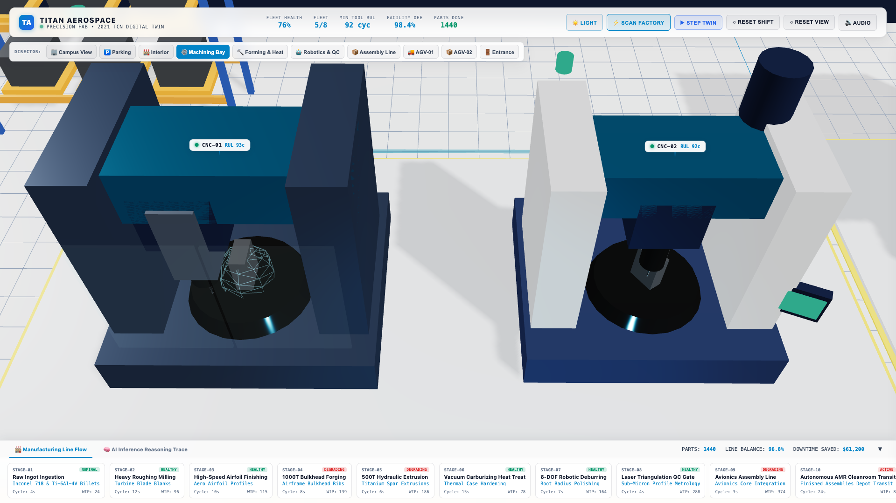

---

### 4. 🔨 Bay 2: Heavy Forming & Thermal Treatment (`PRESS-01`, `PRESS-02`, `FURN-01`)
*Heavy forming and heat treatment wing. Features `PRESS-01` (1000-Ton vertical hydraulic bulkhead forging press with tie-rod columns, nitrogen accumulators, fluid reservoir, ruby safety light curtains, and hot titanium billet), `PRESS-02` (500-Ton horizontal hydraulic extrusion press with runoff roller table carrying titanium spar extrusions), and `FURN-01` (Vacuum Carburizing Furnace with heavy clamping vacuum door, glowing radiant orange quartz heat port, pumping skid, and 980°C controller).*
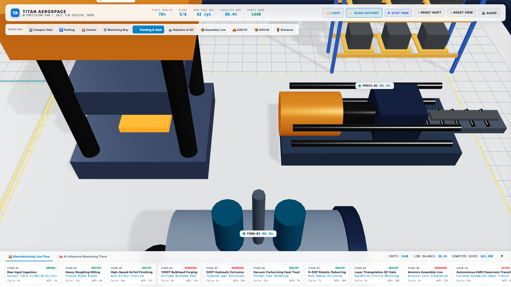

---

### 5. 🤖 Bay 3: Robotics & Quality Control (`ROBOT-01` & `LASER-01`)
*Automated deburring and sub-micron metrology wing. Left: `ROBOT-01` 6-DOF industrial articulated robotic arm inside a yellow perimeter safety fence with clear polycarbonate panels performing root-radius deburring on turbine blades. Right: `LASER-01` Dual Laser Triangulation QC Arch on a black granite surface plate with sweeping cyan planar laser sheet and micrometer readout tower.*
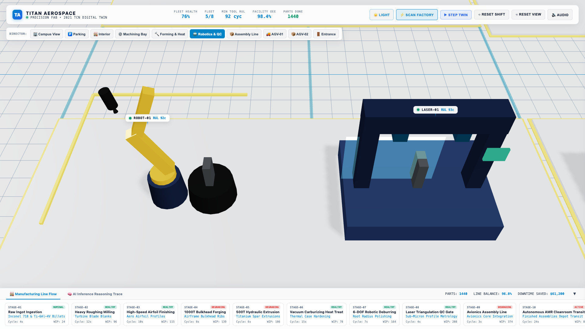

---

### 6. 📦 Bay 4: Avionics Assembly Line (`CONV-01`)
*Automated avionics and blade integration conveyor with emergency red E-stop pull cords. Features an enclosed Laser QC Inspection Tunnel arch with an active vertical cyan laser triangulation scanning plane, overhead digital tolerance HUD (`TOLERANCE ±0.002mm • LASER TRIANGULATION ACTIVE`), and moving aerospace pallet fixtures.*
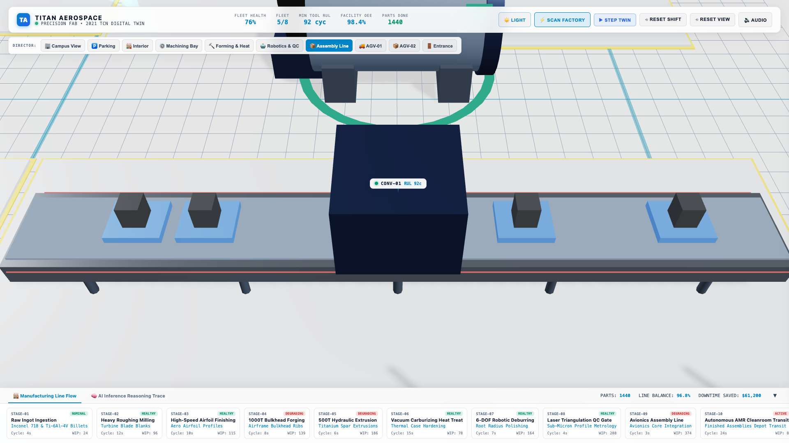

---

### 7. 🚚 Autonomous Logistics Fleet (`AGV-01` & `AGV-02` AMRs)
*Live follow-cam tracking the autonomous mobile robot (AMR) navigating factory transit corridors. Features industrial mecanum wheels, rotating 3D LiDAR puck with forward-projecting scan cone, forward driving spotlights casting dynamic illumination onto the floor, flashing amber safety strobe beacon, and secured payload pallet.*
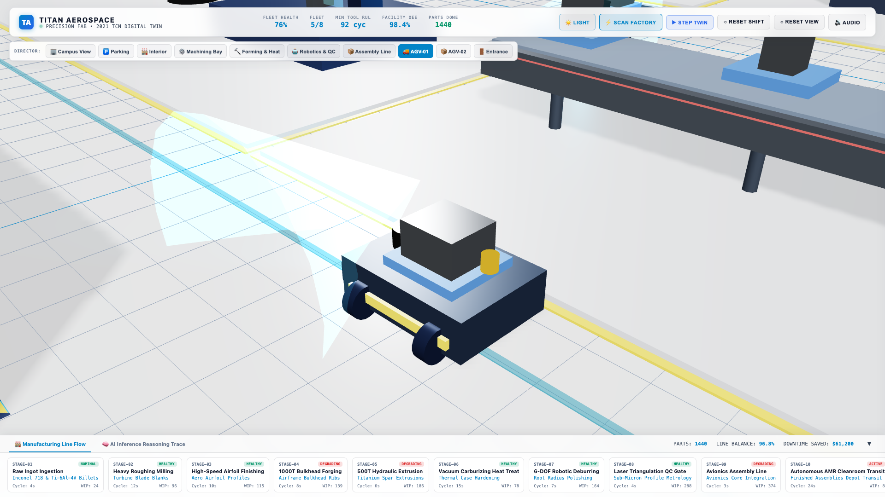

---

### 8. 🅿️ Company Parking Area & Covered Pedestrian Corridor
*Dedicated employee and visitor parking lot featuring marked stalls, parked employee vehicles, dual EV charging stations, security guardhouse with motorized barrier gate, and an architecturally covered steel/glass walkway canopy that directly connects the parking area to the factory cleanroom airlock entrance.*
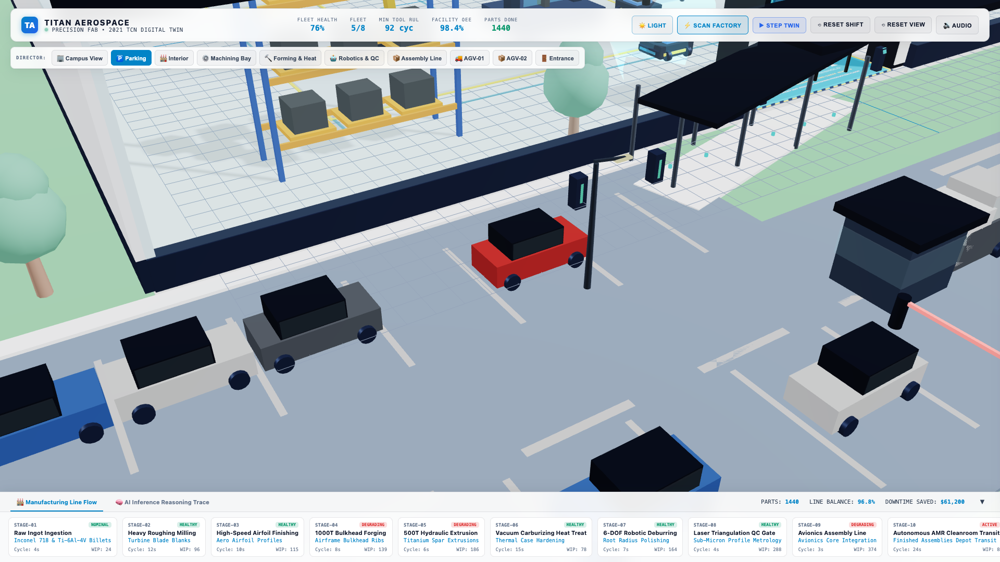

---

### 9. 📊 Holographic SCADA Inspection Drawer
*Slide-out SCADA diagnostic drawer opened by clicking any machine or floating badge. Features real-time physical wear progression, dual-channel 60 FPS oscilloscope spectrum (Ch1: Vibration RMS, Ch2: Core Thermal gradient), 2021 TCN Prognostics hero metric with 15% asymmetric safety margin breakdown, ISO 10816 vibration classification (Zone A to Zone D), Titan Aerospace standard operating procedures (SOP), and one-click closed-loop maintenance execution.*
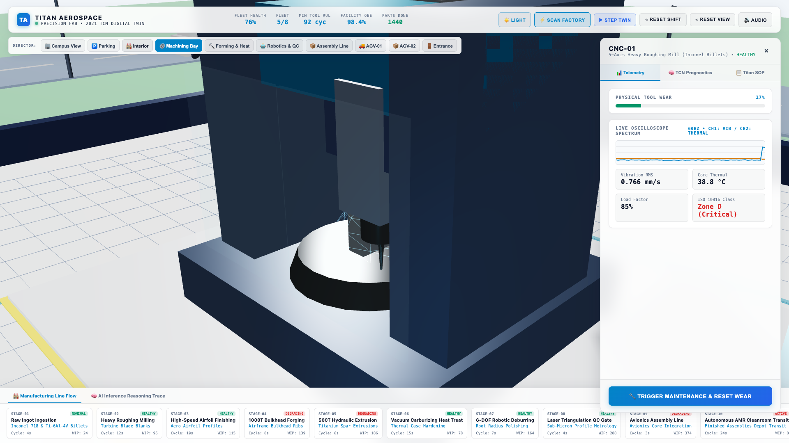

---

### 10. 🏭 10-Stage End-to-End Process Pipeline Ribbon
*Bottom process pipeline docked along the screen edge displaying all 10 physical manufacturing stages: Raw Ingot Ingestion &rarr; Heavy Roughing Milling &rarr; High-Speed Airfoil Finishing &rarr; 1000T Bulkhead Forging &rarr; 500T Hydraulic Extrusion &rarr; Vacuum Carburizing Heat Treat &rarr; 6-DOF Robotic Deburring &rarr; Laser Triangulation QC Gate &rarr; Avionics Assembly Line &rarr; Autonomous AMR Cleanroom Transit. Clicking any stage instantly focuses the camera and opens the machine diagnostics.*
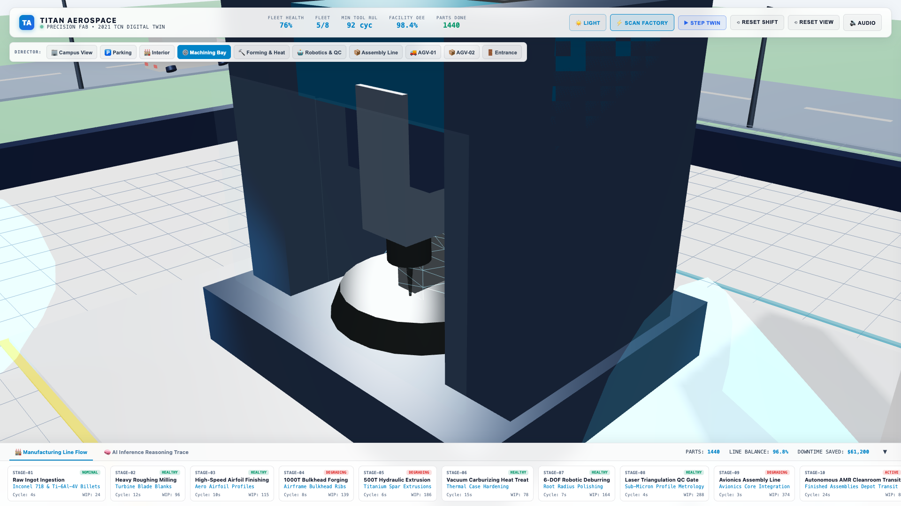

---

### 11. 🌙 Cyberpunk Strategy Theme (Instant Toggle)
*Instant toggle via the `☀️ Light / 🌙 Dark` HUD button switches to the authentic dark cyberpunk strategy environment: deep obsidian reflective epoxy slab, electric neon cyan floor grid (`0x00f3ff`), atmospheric floating dust motes, cyan AGV driving headlights & LiDAR cones, illuminated vehicle headlights, streetlamps, and high-contrast dark SCADA telemetry.*
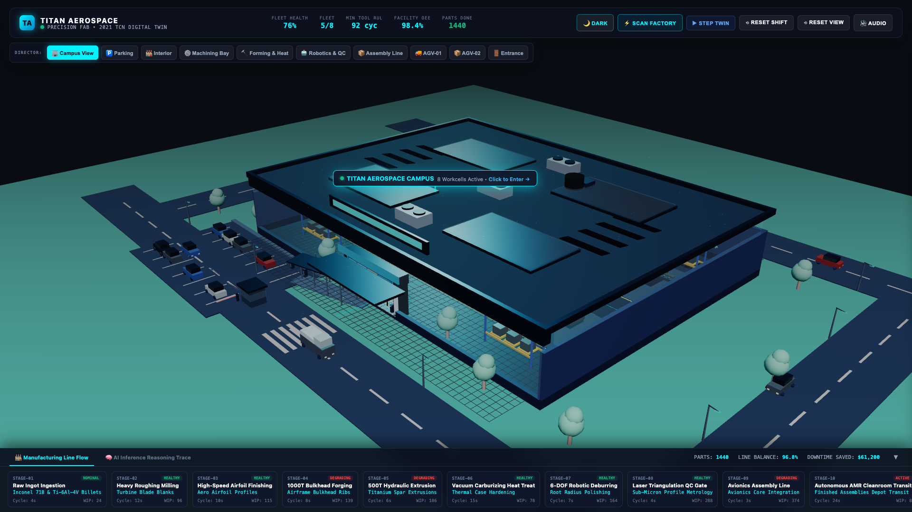

---

### 12. 🚪 Executive Cleanroom Entrance Portal & "TITAN AEROSPACE" Branding
*South perimeter cleanroom airlock entrance featuring illuminated dual-sided company signage (**"▲ TITAN AEROSPACE"**), automated sliding glass airlock doors with stainless steel handles, emerald green positive-pressure status beacon, security RFID card pedestals, contamination control tacky floor runner, and covered pedestrian canopy connection.*
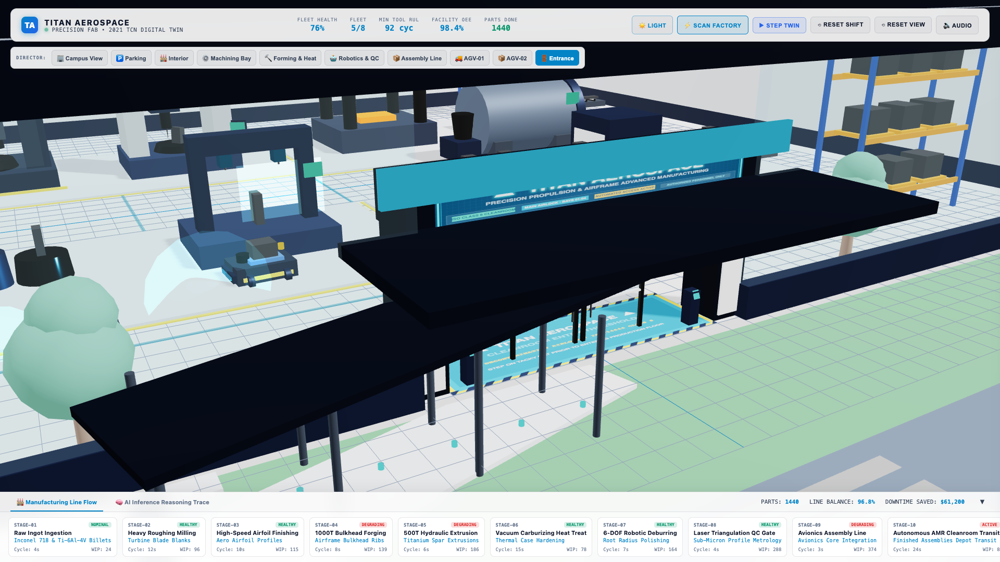

---

## 📖 Teammate Master Guide & Architectural Deep-Dive (`About.md`)

For teammates, reviewers, and stakeholders with **zero prior knowledge of this codebase**, we have prepared a comprehensive onboarding primer: [**`About.md`**](file:///Users/ykanagaraj/Downloads/Personal%20Projects/digital-twin-copilot/About.md).

| Section | What You Will Learn | Direct Link |
| :--- | :--- | :--- |
| **1. The 60-Second Elevator Pitch** | Plain-English summary: SimCity meets NASA rocket factory diagnostic AI | [`About.md #1`](About.md#1--the-60-second-elevator-pitch-what-is-this) |
| **2. The Real-World Problem** | Why unplanned downtime costs $22k/hr & how alarms overwhelm operators | [`About.md #2`](About.md#2--the-real-world-problem-we-are-solving) |
| **3. What is a "Digital Twin"?** | Decoupling physical factory hardware from virtual mathematical models | [`About.md #3`](About.md#3--core-concept-what-is-a-digital-twin) |
| **4. End-to-End System Pipeline** | Visual diagram showing data flow from physics simulation to 3D WebGL screen | [`About.md #4`](About.md#4--the-end-to-end-system-pipeline) |
| **5. Machine Telemetry Ingestion** | How sensors collect vibration, temperature, cycle counts, and the Zero-Feature-Leakage rule | [`About.md #5`](About.md#5--how-we-collect-data-from-the-machines) |
| **6. Machine Learning Diagnostics** | 2021 PHM winner Dilated TCN, Isolation Forest, ISO 10816 standards, and SOP checklists | [`About.md #6`](About.md#6--how-our-ml-models-detect--diagnose-problems) |
| **7. Common Executive Questions** | Executive FAQ: ROI payback, 100% offline ITAR security, legacy retrofits, and alarm fatigue | [`About.md #7`](About.md#7--the-most-frequently-asked-business--executive-questions) |
| **8. Codebase Directory Tour** | File-by-file guide explaining the purpose of every folder and module in the repo | [`About.md #8`](About.md#8--repository-tour-where-everything-lives) |
| **9. Teammate Local Setup Guide** | 2-minute setup, verification tests, and interactive demo walkthrough | [`About.md #9`](About.md#9--teammate-setup-how-to-run-and-demo-it-locally) |
| **10. How to Present This Project** | A 4-step speaking script ready for project presentations, reviews, or vivas | [`About.md #10`](About.md#10--how-to-present--pitch-this-in-a-presentation-or-viva) |

---

## 🎯 Core Purpose & What We Are Doing Here

### The Problem
Traditional SCADA software and manufacturing dashboards (Siemens WinCC, Wonderware, Ignition) are built like 1990s desktop spreadsheets: static 2D tables, disconnected time-series charts, and threshold alarm lists that cause cognitive overload. When a critical spindle bearing begins to degrade, operators are inundated with raw threshold alarms without predictive remaining life estimates, root-cause standard operating procedures, or automated remediation.

### The Solution: Digital Twin Copilot
This project demonstrates how next-generation smart factories should operate by fusing three key disciplines into a single cohesive platform:

1. **Physics-Driven Discrete-Event Digital Twin (SimPy)**:
   A high-fidelity physical factory simulation running via **SimPy**. Rather than using static mock CSVs, the physics engine generates continuous mechanical wear accumulation, thermal dissipation, 60Hz high-frequency vibration harmonic drift, work-in-progress (WIP) queues, and line balancing across **8 distinct aerospace workcells**:
   - `CNC-01`: 5-Axis Heavy Roughing Mill (Inconel 718 Billets)
   - `CNC-02`: 5-Axis High-Speed Airfoil Finishing Center (Airfoil Profiles)
   - `PRESS-01`: 1000-Ton Hydraulic Forging Press (Airframe Bulkhead Ribs)
   - `PRESS-02`: 500-Ton Hydraulic Extrusion Press (Titanium Spar Extrusions)
   - `FURN-01`: Vacuum Carburizing Heat Treatment Furnace (Thermal Case Hardening)
   - `ROBOT-01`: 6-DOF Robotic Deburring & Polishing Workcell (Root Radius Finishing)
   - `LASER-01`: Dual Laser Triangulation QC Metrology Arch (Sub-Micron Profile Verification)
   - `CONV-01`: Modular Dual-Rail Avionics Assembly Line (Avionics Integration)
   - `AGV-01` & `AGV-02`: Coordinated Autonomous Mobile Robots (Cleanroom Transport)

2. **100% Pure Local Machine Learning (Zero API Keys & Zero Cost)**:
   - **2021 PHM Competition Winning Prognostics**: Implements the architecture of Team "IJoinedTooLate" (1st Place, 2021 PHM Data Challenge):
     - **Dilated 1D Causal Temporal Convolutional Networks (TCN)** with exponentially growing receptive fields ($d = 1, 2, 4, 8$) capturing long-term wear trends without recurrent vanishing-gradient bottlenecks.
     - **Variable-Length Sequence Processing**: Evaluates degradation over rolling time windows rather than instantaneous point snapshots.
     - **Piecewise Linear RUL Target**: Caps early healthy cycles at a maximum ceiling ($RUL_{\text{max}}$) to stabilize training dynamics.
     - **Zero Feature Leakage**: Unlike naive tutorials that cheat by passing `wear_level` into model features, our pipeline uses strictly observable sensors (`vibration_rms`, `temperature_c`, $\Delta\text{vibration}$, $\Delta\text{temperature}$, rolling dynamics).
     - **15% Asymmetric Industrial Safety Buffer**: Overestimating tool life leads to catastrophic spindle tool collisions. The scheduler applies $\text{RUL}_{\text{safe}} = 0.85 \times \text{RUL}_{\text{pred}}$ to guarantee zero in-cut failures.
   - **Isolation Forest Anomaly Gate**: Multivariant unsupervised anomaly detector screening sensor streams for early micro-chatter and bearing pitting.
   - **Offline Local SOP Matching**: Local TF-IDF cosine similarity search over plant maintenance Standard Operating Procedures (SOPs) stored in **ChromaDB**. Eliminates all external LLM API dependencies (no OpenAI, no Groq, no Anthropic, zero latency, zero tokens, zero monthly bills).

3. **Autonomous Closed-Loop LangGraph Copilot**:
   A deterministic multi-agent state graph orchestrating the maintenance lifecycle:
   $$\text{Physical Twin} \xrightarrow{\text{Telemetry}} \text{Monitor Agent} \xrightarrow{\text{Anomaly}} \text{Diagnosis Agent} \xrightarrow{\text{SOP Match}} \text{Scheduler Agent} \xrightarrow{\text{Dispatch}} \text{Closed-Loop Twin Interruption}$$
   The copilot autonomously pauses degraded machines, schedules work orders, dispatches robotic maintenance, and resets tool wear back to nominal condition in the live physical simulation.

4. **Executive Cleanroom 3D Strategy Operations Center**:
   Built with **Three.js** and WebGL, inspired by modern aerospace cleanroom facilities (Porsche, Apple, Siemens) and tactical strategy game aesthetics:
   - Real-time hardware-accelerated 3D factory floor with clean polished epoxy slab, perimeter I-beams, and high-bay warehouse pallet storage racks.
   - Overhead yellow industrial gantry crane dynamically traversing across the facility bay carrying turbofan casing components.
   - 8 procedural machinery workcells across 4 zoned production bays.
   - Floating 3D holographic badges projected from world space to screen space.
   - Floating Camera Director Bar with one-click presets (`Overview`, `Machining Bay`, `Forming & Heat`, `Robotics & QC`, `Assembly Line`, `AGV-01`, `AGV-02`).
   - Collapsible bottom Process Pipeline Ribbon displaying 10 manufacturing stages and the 6-step AI reasoning trace.
   - Procedural Web Audio API synthesizer generating tactical SFX without external audio files.

---

## 🏛️ System Architecture

```
+-------------------------------------------------------------------------------------------------------------------------------+
|                                                PHYSICAL DIGITAL TWIN (SimPy)                                                  |
|                                                                                                                               |
|   Ingot Feeder ──► CNC-01/02 (Milling) ──► PRESS-01/02 (Forming) ──► FURN-01 (Furnace) ──► ROBOT-01 (Deburr)                  |
|                                         ──► LASER-01 (Metrology) ──► CONV-01 (Assembly) ──► AGV-01/02 (Cleanroom Transit)    |
|                                                                                                                               |
|                         Vibration RMS • Core Temperature °C • WIP Throughput • Line Balance • ISO 10816 Bands                 |
+---------------------------------------------------------------+---------------------------------------------------------------+
                                                                |
                                                                v
+-------------------------------------------------------------------------------------------------------------------------------+
|                                          LOCAL ML PROGNOSTICS PIPELINE (100% Offline)                                         |
|                                                                                                                               |
|  • Feature Engineering: Zero leakage (observable sensors & rolling dynamics only)                                              |
|  • Anomaly Detection: Isolation Forest contamination filter                                                                   |
|  • RUL Prognostics: 2021 PHM Winner Dilated 1D TCN (d = 1, 2, 4, 8) + Piecewise Linear Target                                 |
|  • Fallback Engine: Scikit-Learn HistGradientBoostingRegressor                                                                |
+---------------------------------------------------------------+---------------------------------------------------------------+
                                                                |
                                                                v
+-------------------------------------------------------------------------------------------------------------------------------+
|                                            CLOSED-LOOP AGENT GRAPH (LangGraph)                                                |
|                                                                                                                               |
|  [Monitor Agent]      ──► Identifies statistical & ML anomaly spikes across all 8 machines                                    |
|  [Diagnosis Agent]    ──► Local TF-IDF cosine matching against ChromaDB plant SOPs (ISO 10816 Zones A-D)                      |
|  [Scheduler Agent]    ──► Applies 15% Asymmetric Safety Buffer (RUL_safe = 0.85 * RUL_pred)                                   |
|  [Closed-Loop Action] ──► Interrupts physical SimPy twin, triggers maintenance, resets wear                                   |
+---------------------------------------------------------------+---------------------------------------------------------------+
                                                                |
                                                                v
+-------------------------------------------------------------------------------------------------------------------------------+
|                                    3D STRATEGY OPERATIONS CENTER (FastAPI + Three.js)                                         |
|                                                                                                                               |
|  • WebGL 60 FPS Viewport  • 4 Production Bays  • Camera Director Bar  • 3D Floating Badges  • SCADA Drawer Oscilloscope       |
|  • 10-Stage Process Pipeline Ribbon  • Laser Radar Sweep  • Executive Cleanroom Light Mode & Cyberpunk Dark Mode Toggle       |
+-------------------------------------------------------------------------------------------------------------------------------+
```

---

## 📁 Repository Structure

```
digital-twin-copilot/
├── digital_twin/
│   ├── models.py              # Physical machine states, configs & maintenance events
│   └── simulator.py            # SimPy discrete-event physical twin engine (8-machine fleet)
├── ml_pipeline/
│   ├── features.py            # Observable sensor feature extraction & piecewise clipping
│   ├── tcn_model.py           # 2021 PHM Winner 1D Dilated Temporal Convolutional Network
│   ├── anomaly_detector.py    # Isolation Forest multivariant detector
│   └── rul_predictor.py       # Sequence-based TCN predictor + GBDT fallback
├── rag/
│   ├── documents/             # ISO 10816 SOP maintenance manuals (CNC, Press, Furnace, Robot, QC)
│   └── knowledge_base.py      # ChromaDB vector store + TF-IDF cosine similarity search
├── agents/
│   ├── state.py               # Shared LangGraph agent state dictionary
│   ├── tools.py               # Closed-loop tools (what-if simulator, repair execution)
│   ├── monitor_agent.py       # Statistical and ML telemetry scanner
│   ├── diagnosis_agent.py     # Local NLP SOP root-cause diagnosis matcher
│   ├── scheduler_agent.py     # 15% asymmetric safety-margin maintenance scheduler
│   └── orchestrator.py        # LangGraph wiring and simulation execution graph
├── api/
│   └── main.py                # FastAPI backend serving endpoints, 10-stage flow & static 3D webapp
├── web/
│   ├── index.html             # Cleanroom strategy HUD & WebGL canvas container
│   ├── css/
│   │   └── style.css          # Executive cleanroom light theme (default) & dark mode CSS
│   ├── js/
│   │   ├── app.js             # Main application orchestrator & live polling loop
│   │   ├── scene.js           # Three.js scene engine, 8 machines, 2 AMRs, daylight illumination
│   │   ├── models.js          # Procedural 3D machinery (ASRS racks, crane, 8 workcells, AMRs)
│   │   ├── hud.js             # Top KPIs, floating badges, oscilloscope & 10-stage pipeline ribbon
│   │   └── audio.js           # Procedural Web Audio API sound synthesizer
│   └── vendor/
│       ├── three.min.js       # Vendored Three.js core (offline zero-build)
│       └── OrbitControls.js   # Vendored camera orbit controls
├── docs/
│   └── screenshots/           # High-resolution screenshots of the 3D operations center
├── tests/
│   ├── test_digital_twin.py   # Physical simulation tests
│   ├── test_ml_pipeline.py    # TCN & anomaly detector tests
│   ├── test_agents.py         # Multi-agent LangGraph workflow tests
│   └── test_api_web.py        # FastAPI endpoints & 10-stage pipeline flow tests
├── capture_screenshots.py     # Playwright multi-angle screenshot capture script
├── requirements.txt
└── README.md
```

---

## ⚡ Quickstart

### 1. Prerequisites & Installation

Requires **Python 3.10+**. Zero external API keys, zero node/npm build dependencies:

```bash
# Clone the repository and switch to the active feature branch
git clone https://github.com/vishnu-0011/digital-twin-copilot.git
cd digital-twin-copilot
git checkout feat/3d-strategy-game-ui

# Create and activate virtual environment
# macOS / Linux:
python3 -m venv venv
source venv/bin/activate

# Windows (Command Prompt / PowerShell):
# python -m venv venv
# .\venv\Scripts\activate

# Install dependencies
pip install -r requirements.txt
```

### 2. Run Automated Verification Tests

```bash
python -m unittest discover -s tests -p "test_*.py"
```
*(All 16 unit and integration tests run with 100% pass rate).*

### 3. Launch the 3D Operations Center

```bash
uvicorn api.main:app --port 8000
```

Open your browser to:
👉 **`http://localhost:8000/`**

---

## 🎮 How to Interact with the Operations Center

- **Theme Switcher (`☀️ Light / 🌙 Dark`)**: Toggle between the Executive Cleanroom Light Theme (default, ideal for executive presentations and HOD reviews) and the Cyberpunk Night Theme.
- **Camera Director Presets**: Click `🌐 Overview`, `⚙️ Machining Bay`, `🔨 Forming & Heat`, `🤖 Robotics & QC`, `📦 Assembly Line`, `🚚 AGV-01`, or `📦 AGV-02` on the floating director bar to smoothly fly the camera across the plant.
- **Inspect Workcells**: Click any machine in the 3D scene, its floating badge, or any node in the bottom pipeline ribbon to open the **Holographic SCADA Drawer**. Inspect live 60 FPS vibration waveforms, core thermal gradient, TCN remaining life forecasts, and Titan Aerospace standard operating procedure recommendations.
- **Trigger Closed-Loop Maintenance**: Click **"🔧 Trigger Maintenance & Reset Wear"** inside the SCADA drawer to dispatch maintenance in real time, resetting the physical twin's wear back to nominal.
- **Toggle Process Flow Modes**: Toggle between **"🏭 Manufacturing Line Flow"** (tracking parts transit across all 10 stages) and **"🧠 AI Inference Reasoning Trace"** (revealing the 6-step ML pipeline from raw sensor feeds to risk-buffered scheduling).
- **Sweep Factory Radar**: Click **"⚡ Scan Factory"** to sweep a glowing cyan laser plane across the facility, trigger the LangGraph anomaly detection cycle, and produce tactical synthesizer audio feedback.
- **Step Simulation Cycle**: Click **"▶ Step Twin"** to advance the SimPy physical simulation clock forward.
- **Reset Shift**: Click **"⟲ Reset Shift"** to restore all 8 workcells to nominal fresh-shift operating conditions.

---

## 📄 License

MIT License. Designed with highest-effort engineering for smart manufacturing digital twin operations.
